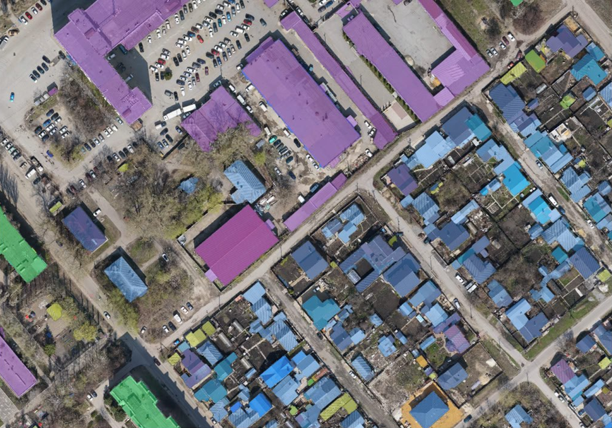

# Общая информация

## Задача
Задача получения предсказания мультиклассовой сегментации крыш домов, для определения кадастрового учёта зданий, типа зданий и рассчёта площади.
Классы представлены 5 видами:
* Background (фон)
* single roof (односкатные крыши)
* industrial (индустриальные постройки)
* apartment (многоквартирные дома)
* multi roof (дома с многоскатными крышами)

Разметка производилась собственными силами.

## Данные
Данные представлены в виде снимков БПЛА с разрегение 0,6 м/пиксель. Один снимок размера 8192x8192 пикселей. Снимки представляют из себя городскую или сельскую зайстроку. Поскольку каждый снимок крпуного размера, в среднем 8192x8192, то каждый снимок необходимо разделить на патчи. В ходе эксперементов было установлено, что наиболее качественный результат получается с патчем 1024х1024.
Примеры результатов:

 
## Установка зависимостей
``` make install_all_requirements ```

## Описание репозитория

* `0_cache_dataset.ipynb` - предобработка датасета, разбиение на патчи;
* `2_Segmentation_of_houses.ipynb` - запуск обучения сегментации домов;
* `3_Inferense.ipynb` - инференес целевых снимков;
* `Makefile` - файл содержит комманды для установки пакетов;
* `requirements.txt` - пакеты для установки;
* `config.yml` - конфиг файл для процесса обучения;
* `README.md` - файл с описание репозитория;
* `utils` - директория с основными файлами для обучения модели и логгирования результатов;
    * `augmentation.py` - получение словаря аугментация из конфига;
    * `boundary_loss.py` - скрипт содержит класс функции потерь для boundry лосса;
    * `custom_loss.py` - скрипт для написани классов функций потерь, а также содержит класс для объединения функций потерь и их развисовки;
    * `data.py` - скрипт для формирования датасета и создания выборок на основе StratifiedShuffleSplit;
    * `dataset_class.py` - скрипт содержит класс данных для обучения моедли;
    * `evaluate.py` - оценить на тестовом/валидационном датасете метрики;
    * `Image_processing.py` - скрипт для обработки изображений, получения патчей;
    * `logger.py` - залогировать метрики, картинки, данные в Clearml;
    * `metrics.py` - оценить качество модели по различным метрикам;
    * `training.py`- скрипт для тела обучения модели;
    * `utils.py` - вспомогательные скрипты, поиск файлов опредленного типа, прочтение конфигов.